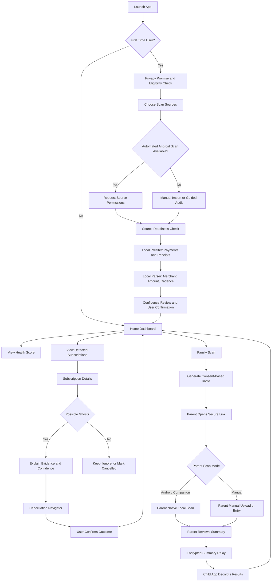

# App Flow Diagram: Subscription Ghost Buster

## MVP Stance
- The automated MVP is Android-first. iOS and web cannot provide the same SMS, notification, or installed-app visibility, so they should be treated as companion/manual modes until proven.
- The Family Scan web link cannot scan a parent's SMS or notifications by itself. It can collect consent, open/install a native companion, or accept manual input/upload.
- "Ghost" should be shown as a confidence-based signal, not an absolute fact. A missing app does not always mean the subscription is unused.

## Primary Android Flow

## Flow Notes
1. **Onboarding**: Show what data is read, what stays local, and what cannot be supported on the current device. Do not request sensitive permissions before the user understands the value.
2. **Scanning**: Use a two-stage scan: fast local rules to filter candidate messages, then a small local parser/classifier only for candidates. Background indexing can continue after the first result set.
3. **Review**: Put low-confidence detections behind a review step so false positives do not damage trust.
4. **Ghost Detection**: Match merchants to a targeted allowlist of app package IDs. Use "possible ghost" when there is no installed app match, but explain that web-only subscriptions and shared family accounts can be valid exceptions.
5. **Cancellation**: Prefer verified deep links where available, but always provide versioned visual guides because UPI app screens and routes can change.
6. **Family Scan**: Parent must explicitly review and approve the summary before any data is returned to the child. Results should be encrypted for the child's device and expire from the relay.

## Failure and Empty States
- Permission denied: offer manual audit, statement upload, or "try later"; do not block all product value.
- No subscriptions found: show scan coverage, sources checked, and next steps instead of a blank dashboard.
- Parser uncertain: mark as "Needs review" and avoid health-score penalties until confirmed.
- Cancellation route unavailable: show generic mandate-revocation guide and record the route as unverified.
